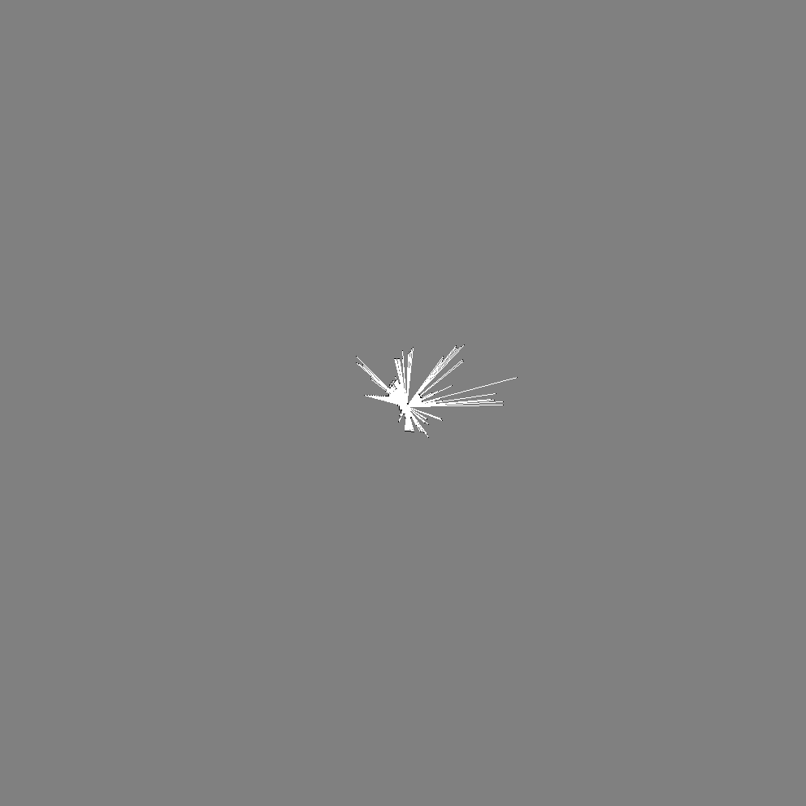
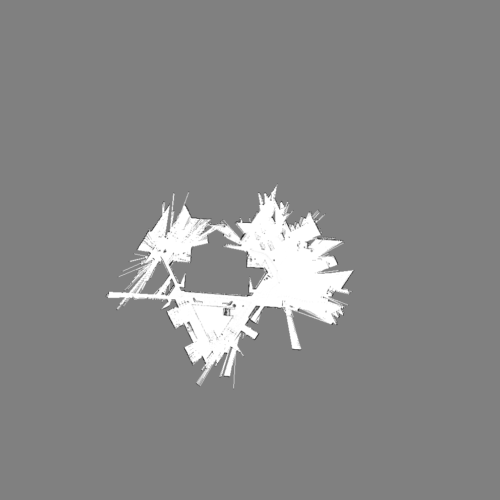
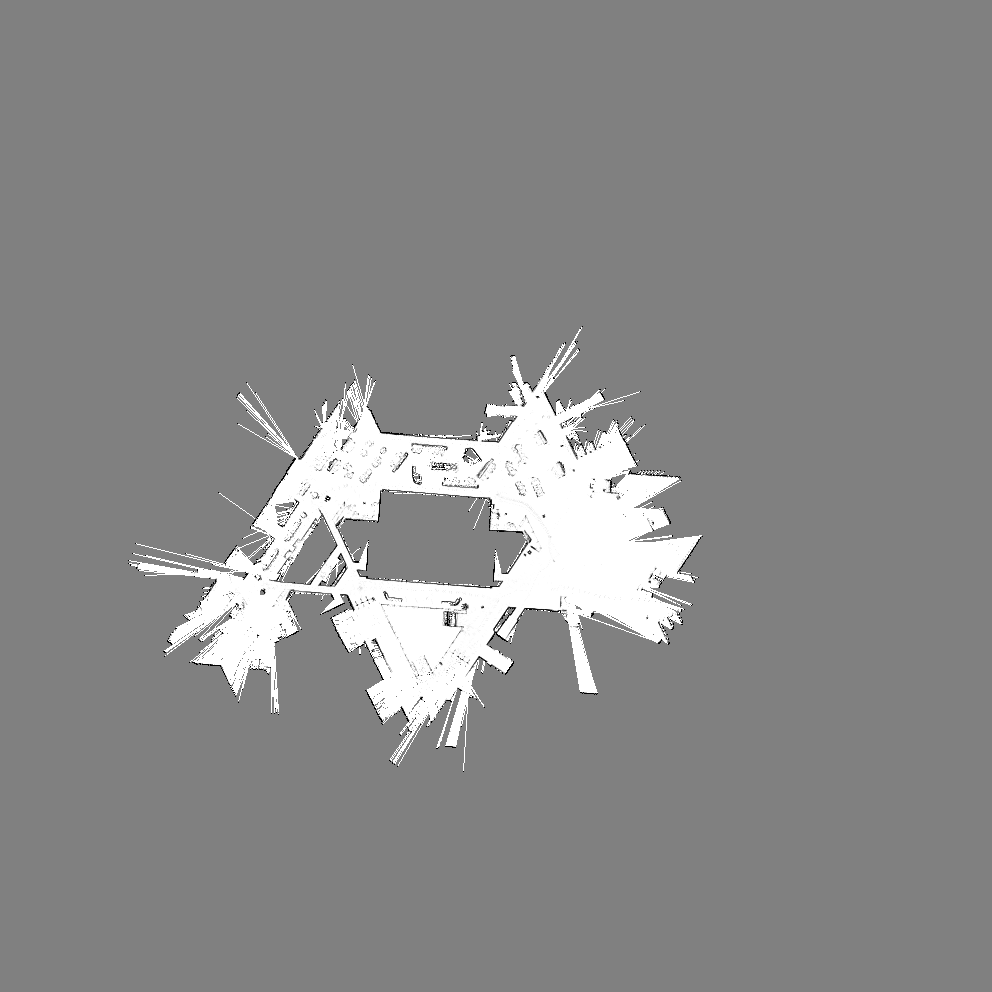
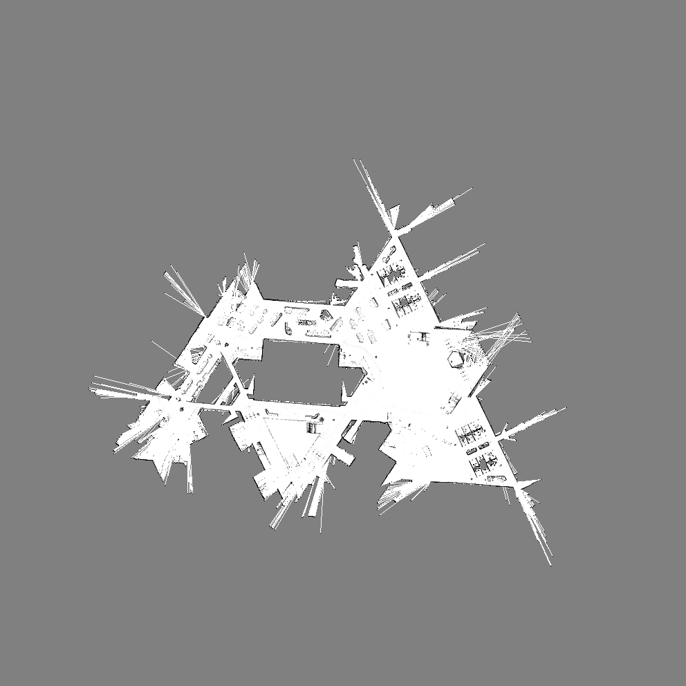
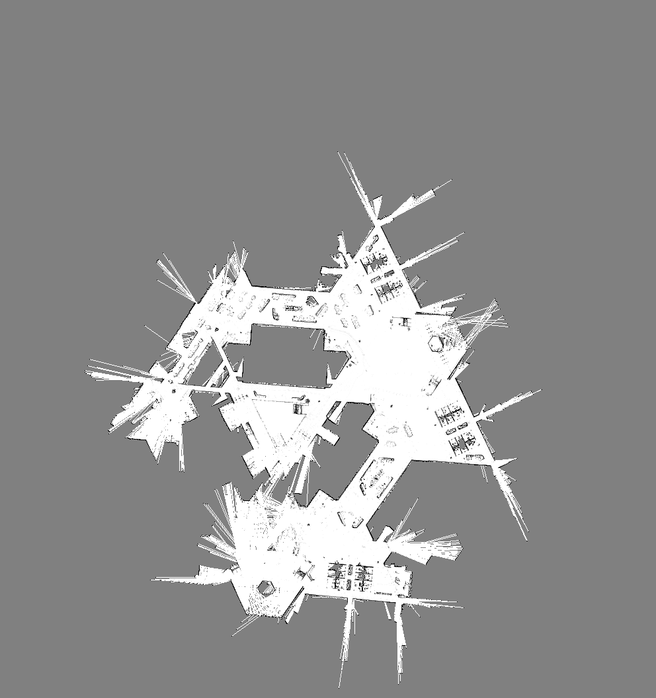
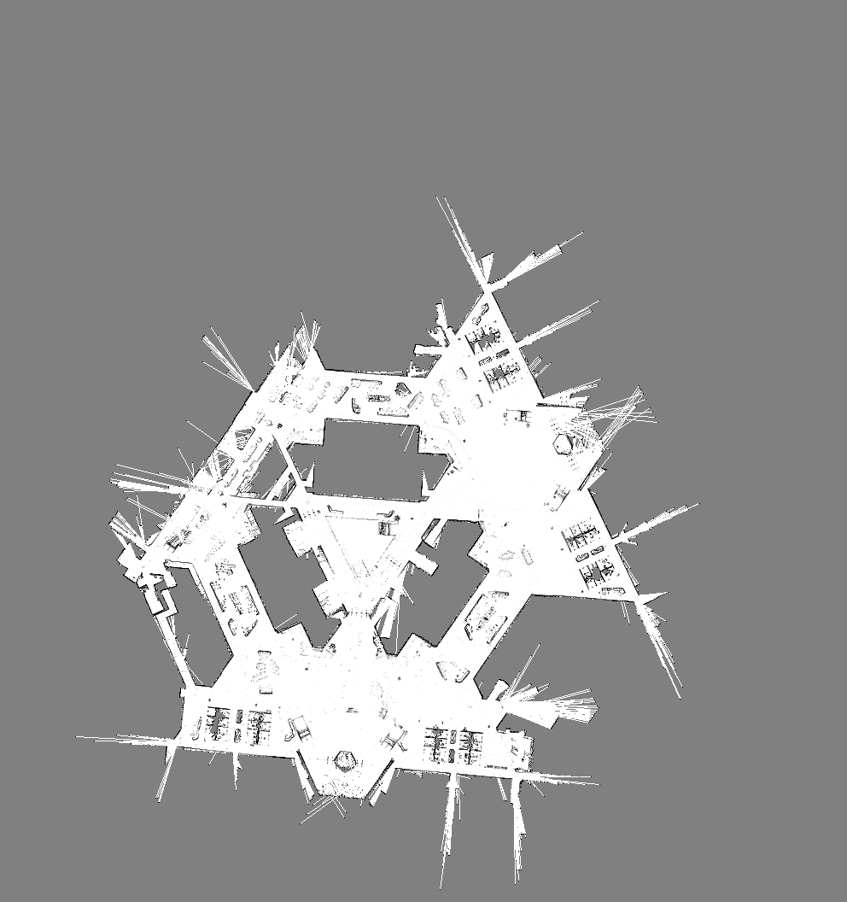
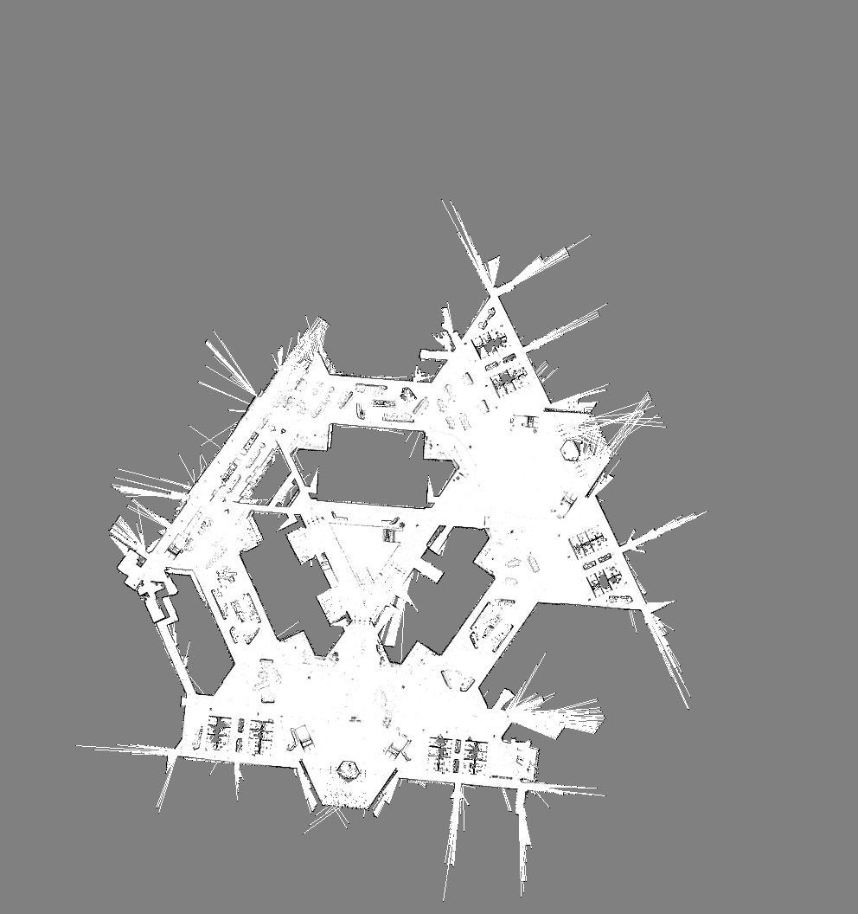

..
   Copyright (c) 2020, NVIDIA CORPORATION. All rights reserved.
   NVIDIA CORPORATION and its licensors retain all intellectual property
   and proprietary rights in and to this software, related documentation
   and any modifications thereto. Any use, reproduction, disclosure or
   distribution of this software and related documentation without an express
   license agreement from NVIDIA CORPORATION is strictly prohibited.

.. _gmapping_application:

GMapping Application
====================

GMapping is a map generating tool that uses the OpenSlam software library. The application allows
you to create maps to use in other applications.

The GMapping application uses the LIDAR capabilities of the Carter reference robot.

.. note:: Mapping is a computation-intensive and storage-intensive activity that may require fine
          tuning to generate an appropriate building map. For best results, record your mapping logs
          and tune the GMapping parameters offline.

Leverage odometry or the pose tree for the robot pose, depending on the capabilities of your robot.
Use an inertial measurement unit (IMU) to improve results.

While you can run the GMapping application on a desktop, for actual mapping it must be deployed and
run on a Carter robot.

To Deploy and Run the GMapping Application
------------------------------------------

1. Deploy //apps/carter/gmapping:gmapping-pkg to the robot as explained in :ref:`deployment_device`.

2. Run the GMapping application while selecting the target robot profile:

   .. code-block:: bash

      bob@carter1:~/gmapping-pkg$ ./apps/carter/gmapping/gmapping --config "apps/carter/robots/carter_1.config.json"

Output
^^^^^^^^^^^^^^^^^^^^^^^^^^^^^^^^

The sample application writes the maps into the :code:`/tmp/map.img_<N>.png` folder throughout
the run.
Specify the output path with the following configuration parameter for the Gmapping codelet:

.. code-block:: bash

   "config": {
     "gmapping.gmapping": {
       "GMapping": {
         "file_path": "/tmp"
       }
     }
   }

Mapping Example
---------------

The sequence of images below illustrates the mapping process over time, from the first LIDAR data
capture to a map of a building.

Mapping Recommendations
-----------------------

The speed at which the robot moves during mapping has an impact on results. The slower the speed,
the higher number of LIDAR samples, resulting in increased accuracy. Avoid sharp turns. Configure
the robot to limit the maximum linear and angular speeds.

Match and close path loops regularly to correct drifts and errors in odometry and inertial
measurements during mapping. The matching depth is finite. Where possible, navigate in circles
around blocks in the building, such as cubicle corrals and large architectural elements. There is
no need to drive through an already mapped area; it increases noise.

Maintain enough anchor points from frame to frame. This is especially important when exiting or
entering new areas or turning into a hallway. Avoid driving too close to walls. Select a quantity of
(matching) particles that is as high as your building topology allows you to without losing scan
matching or reverting to odometry only, which results in poor mapping results.

Use a long enough range to help maintain anchor points but use a small update range to draw a
sharp map image. Ideally, your update range should be no larger than half the length of the largest
area to map.

Record your scan and odometry channels to replay and create new maps with different parameters after
the real world capture is completed with the log mapping applications. Tune the configuration
parameters to experiment for your mapping use case.

When working with maps generated by GMapping or logamppings, trim the gray edges of the map image.
This reduces the size of the file and improves the performance of the algorithms using the map
image. After modification, save these maps as grayscale, compressed, in PNG format, for significant
reduction in file size.

