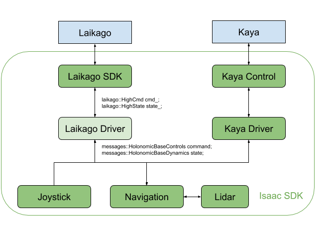

Autonomous Navigation for Laikago Quadruped
===========================================

Developing an intelligent robotic system is multi-disciplinary work, integrating dynamics,
control, computer vision, artificial intelligence, and more. It is hard to master all these fields.
Even if you master them all, it takes a lot of time to get it right and robust.

To help roboticists accelerate the development of intelligent robots, NVIDIA Isaac SDK includes
reference applications and platforms. One of these is platforms is :ref:`Kaya <kaya_software>`,
a three-wheeled holonomic autonomous robot. The Laikago application was built using Kaya as a
reference to create an autonomous machine that can navigate and avoid obstacles.

Laikago is a quadruped robot made by Unitree Robotics. It features a locomotion control
algorithm for walking and balancing in the Microcontroller unit (MCU). It also provides a mount as
an optional package, which includes the `NVIDIA Jetson TX2 Module <https://developer.nvidia.com/embedded/jetson-tx2>`_
for a brain, allowing users to develop custom software and access locomotion
control and the sensor data. Out of the box, it does not have any sensor or software for mapping,
localization, or obstacle avoidance.

This application uses a Velodyne VLP-16lidar for perception, and integrates the Isaac SDK
navigation stack with the Unitree Robotics API. All computation is done inside the TX2. The
locomotion controller runs at 500Hz, while the navigation stack requires 50% of the CPU. When
running this application, the Laikago walks at a peak speed of 0.6 m/s.

.. image:: images/laikago_photo.jpg
   :align: center

Upgrading the Hardware
-----------------------

You will need to mount both the lidar and the interface box to the Laikago. We designed 3D printed
mounts based on the Laikago CAD files from the Unitree GitHub repo. Laikago provides 19V output,
which is higher than the operational voltage of the VLP-16.

.. note:: The newest VLP-16 supports up to 32V from its specs.

We suggest using a DC-DC converter to decrease the voltage and a USB-to-Ethernet
to connect the lidar sensor to the TX2. You can also mount a compatible camera for
object detection, though it is not applied in this example application. The figure
below shows the overall setup.

.. image:: images/laikago_vlp16.jpg
   :align: center

The Isaac SDK navigation and perception stack is agnostic to the sensor brand and type of Jetson
board. For instance, Kaya uses the same navigation stack but runs on Jetson Nano and uses a camera
instead of a lidar sensor for localization. Many of the perception algorithms for Kaya also work on
a simple webcam.

Software Overview
-------------------

This application primarily uses the Isaac SDK navigation stack, which includes maps, localization,
global path planning, control, obstacle avoidance, odometry, and path tracking. The Isaac SDK also
includes a lidar driver and the Laikago SDK, so no extra libraries or dependencies are required.

The figure below shows the design hierarchy. All rounded boxes are included in Isaac SDK. The
rectangular boxes specify the robot hardware. The Laikago driver is mostly used to pass the messages
from Isaac SDK to the Laikago SDK.

Running the Laikago Navigation Application
------------------------------------------

1. Make sure the Jetson device is set up as detailed in the :ref:`setup-isaac` document.

2. Build an ARM target and deploy it to the robot with the following command:

   .. code-block:: bash

      bob@desktop:~/isaac$ ./engine/build/deploy.sh --remote_user <username> -p //packages/laikago/apps:laikago_navigate-pkg -d jetpack43 -h <robot_ip_address>

   Where :code:`<username>` is your username on the robot (:code:`nvidia` by default), and
   :code:`<robot_ip_address>` is the IP address of the robot.

3. SSH into the robot with the following command:

   .. code-block:: bash

      bob@desktop:~/isaac$ ssh <username>@<robot_ip_address>

   Where :code:`<username>` is your user name on the robot (:code:`nvidia` by default), and
   :code:`<robot_ip_address>` is the IP address of the robot.

4. Run the Laikago application on the robot with the following command:

   .. code-block:: bash

      bob@jetson:~/$ ./packages/laikago/apps/laikago_navigate --config <map_config_json> --graph <map_graph_json>

   Where :code:`<map_config_json>` and :code:`<map_graph_json>` are the map files. Samples are
   provided in the :code:`apps/assets/maps` folder.

5. Connect to a Bluetooth joystick controller. We use the NVIDIA Shield controller in this example.
   This can be used to both send directional commands to the Laikago and trigger the
   autonomous navigation mode.

.. note:: By default, the robot is in the "stance" mode. When the directional command passes a small
          threshold, the robot will start to walk. See the :ref:`joystick` section for more
          information.

6. Open Isaac Sight in a browser at :samp:`<robot_ip>:3000`. You should see the map where the
   Laikago is localized. Use the joystick to move the Laikago around and observe the map updates.
