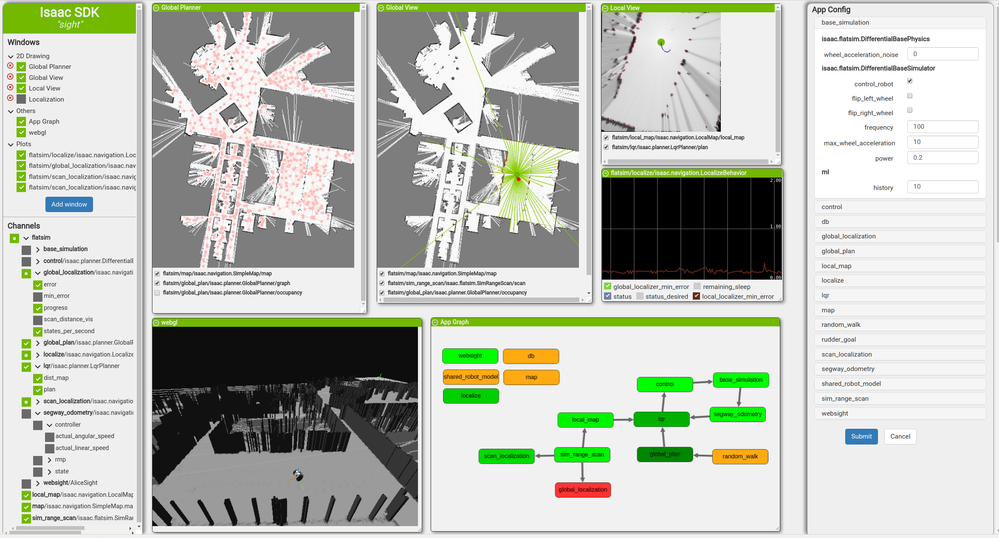
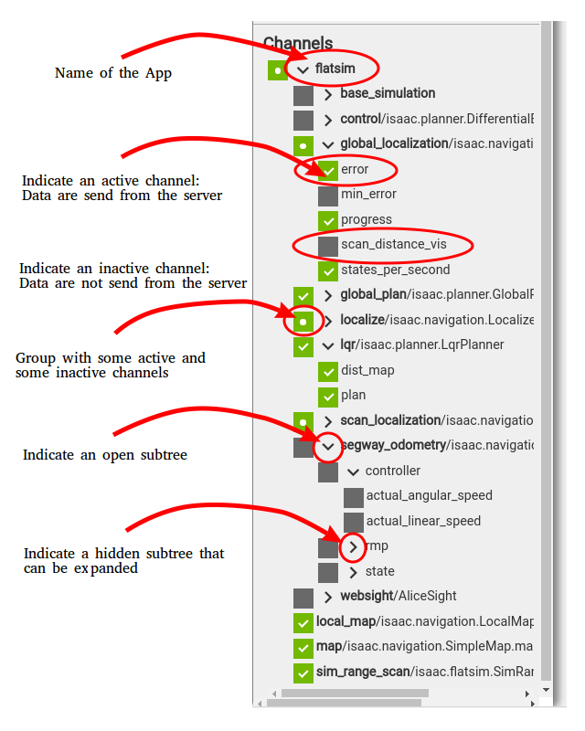
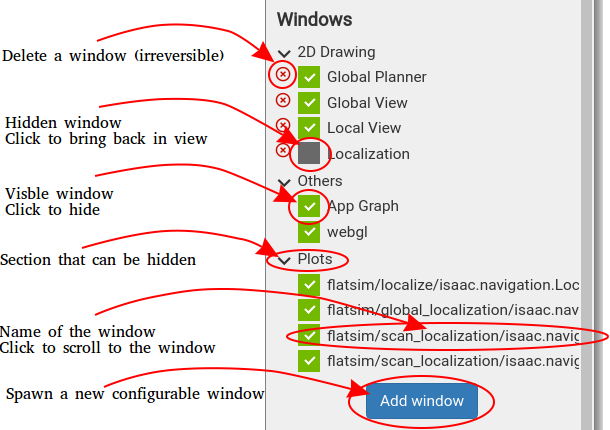
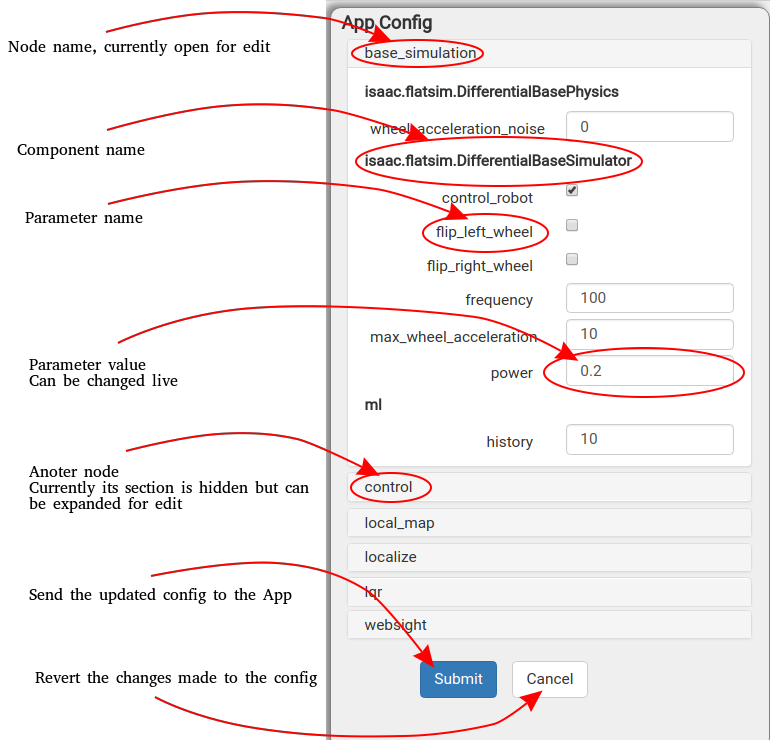
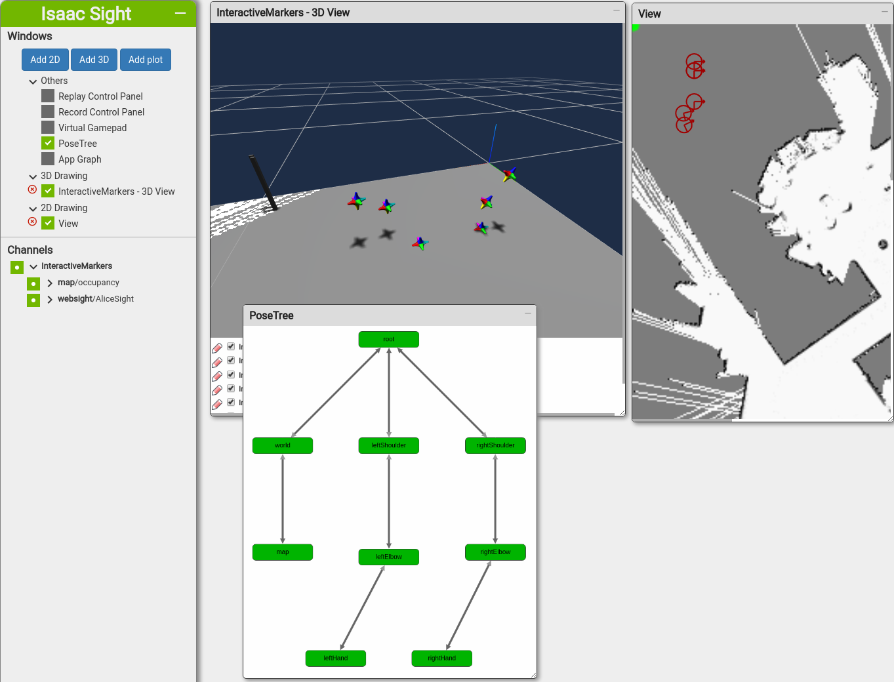
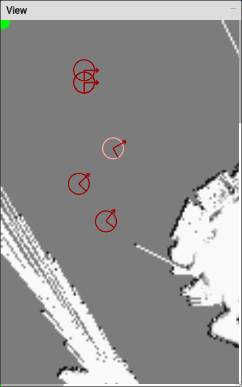
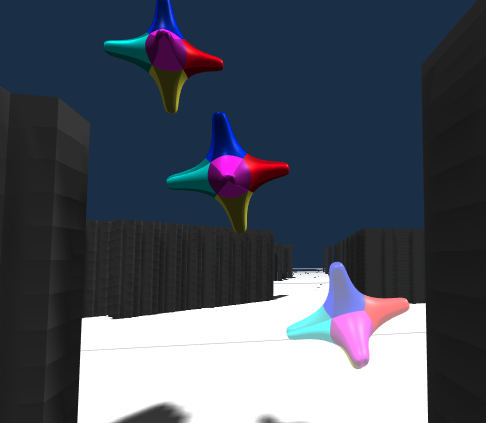
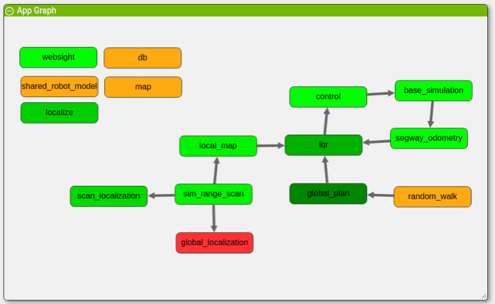
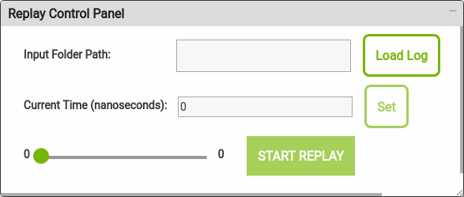
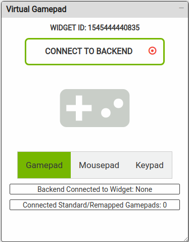

..
   Copyright (c) 2020, NVIDIA CORPORATION. All rights reserved.
   NVIDIA CORPORATION and its licensors retain all intellectual property
   and proprietary rights in and to this software, related documentation
   and any modifications thereto. Any use, reproduction, disclosure or
   distribution of this software and related documentation without an express
   license agreement from NVIDIA CORPORATION is strictly prohibited.

Sight (Front End)
-----------------------------------------

When you open your browser at the default link for sight, :samp:`http://127.0.0.1:3000/` you find a
page similar to the one below. This is the main Sight window.

UI Organization
^^^^^^^^^^^^^^^^^^^^^^^^^^^^^^^^^^^^^^^^

The UI is organized into a Channel Menu, Windows menu, Configuration menu, and the Window Container.

Channel Menu (Bottom Left)
..........................

The channel menu lists all of the channels the application is publishing to. The channels are sorted
first by application, then node, then component, and then the name of the channel is split using
“.”. Internal nodes with only one child are merged with their child to reduce the size of the tree.

Internal nodes are easily recognizable by the adjacent arrow showing the current status, whether or
not their children are visible.

When a channel is disabled from the channel menu no data is sent from the server. This saves
bandwidth and computation load on the application, but the information is not logged or otherwise
preserved for later analysis.

You can enable or disable any section of the tree at once.

.. _sight-windows-menu:

Windows Menu (Top Left)
.......................

The windows menu contains the list of all the currently available windows, organized into 4
categories:

* **2D Drawing:** A window showing renderings of 2D operations such as drawn images, drawn lines,
  circles, and others. They are customizable and can be hidden using the checkbox or deleted using
  the red cross. You can create a new 2D drawing at any time using the button in the bottom of
  the menu. See `2D Rendering`_ for details.

* **Plots:** A list of the windows showing plots. Plot customization is planned for a future release.

* **Others:** A list of all other windows, such as the graph of the currently running application, the
  recorder, and others.

* **3D Rendering:** In this release only WebGL is available, but other 3D rendering windows are planned
  for a future release.

Every window can be hidden using the checkbox. Clicking on the name of a window scrolls the view
to that window.

Configuration Menu (Right Panel)
................................

The configuration menu contains the list of nodes currently running. Expand each node to display
their components and the list of parameters for each component.

These parameters can be changed and the robot updated. Note that some parameter changes are not
immediately apparent if the robot is not actively monitoring the changed areas. For example, the
frequency is only read during the start of the program, and not during continued execution.

Window Container
................

The window container contains all windows currently visible and listed in the window menu. Windows
can be dragged to customize the view, and hidden by clicking on the top left icon. Use the window
menu to display previously hidden windows.

List of Window Types
....................

Sight has the following window types, described in the following sections:

* **2D Drawing:** 2D drawing windows show a customizable 2D view of the robot. They can be used to
  display camera images and maps with overlays such as scan beams, robot position, detected
  obstacles, and others.

* **3D Drawing:** 3D drawing windows are similar to 2D drawing windows except that they are rendered
  in 3D.

* **plots:** Plot windows show graphical representations of some information, useful for system
  monitoring.

* **Graph:** Graph windows display the graph of the current application and individual node
  execution status.

* **Recording:** Can enable and disable recording.

* **Replay:** Can control replay.

Shortcuts
.........

The following keyboard shortcuts are available:

* **Enter:** Press enter to reorganize the windows so that they do not overlap.

* **Arrows:** Use arrow keys to move the camera in 3D views.

* **Right click:** Right click on a rendering view display the available menu.

* **Middle-mouse click:** While pointing to a channel name on the left menu, click the middle button
  of the mouse to copy the full name to the clipboard.

Rendering
^^^^^^^^^^^^^^^^^^^^^^^^^^^^^^^^^^^^^^^^

2D and 3D rendering are available. Both views are customizable: you can create a new view using one
of the two buttons on the windows menu. Once the view is created, choose what channel to render and
in which order. Both views can be used to render 2D or 3D data.

Right click on the view to access the menu:

* Enable/disable all channels at once
* Take a screenshot of the view
* Start and stop recordings
* Access settings to add/remove channels and change the size of the rendering
* Display or hide color and pixel information about the object at the mouse pointer (2D views only)

There is a channel list below the view. Clicking on the icon in the left side of a given channel
gives access to channel specific menus. Use the checkbox to enable or disable a channel from the
view.

Channels that appear red are not enabled, and not being updated.

Both 2D and 3D views use a fix 0.2s delay in the rendering in order to synchronize the data to render.
If the messages come with a higher latency than this delay, or if some messages are dropped (either
due to throttling from the codelet, for example ColorCameraViewer or from the network itself), this
might also result in rendering channels out of sync.

Both the 2D and 3D views can contain interactive pose markers meant to represent an editable
pose of the Pose Tree. See :ref:`interactive-markers-configuration` for information about marker
configuration.

Interactive pose markers allow you to edit poses using either 2D or 3D render widgets.

Three 2D interactive pose markers are shown below. The highlighted one is selected for rotation.

Three 3D interactive pose markers. The highlighted one is selected. The various segments are
distinguishable by color.

Settings Menu
.............

The Settings menu contains:

* The window name.
* The current dimensions of the rendering. (These can be changed, but they may be overridden by a
  channel).
* A drop-in menu with the list of all available channels.
* A list of all channels currently being rendered. On the left side the arrows let you reorder
  channels, Use the icon on the right to remove channels. In addition you can also add a new channel
  directly from the channel menu by right clicking on the channel name. You can also create a new
  renderer directly from one or a group of channels using the channel menu.

2D Rendering
............

2D objects are rendered layer per layer and in the order they are listed. Each channel comprises one
layer, and the layer menu lets you pick the transparency (alpha channel), the size (for points and
lines), and the default color (if none is specified.)

3D objects are rendered using an orthographic projection along the Z axis, and the first channel is
used as the reference frame.

If an image is rendered in the first channel, the window is automatically resized to match the size
of the image.

The mouse can be used to zoom in and out of the produced image.

3D Rendering
............

For each layer of the a 3D rendering, the color and size can be customized as for a 2D rendering,
and a default Z can be set in order to render 2D objects in the 3D world.

The rendering is done in the world coordinate system and images are interpreted as an occupancy
grid, if the value of a pixel is greater than 127, then the cell is considered empty. Otherwise a
wall is displayed.

The view can be controlled using the mouse or keyboard:

* Translation: keyboard arrows, or mouse right click
* Rotation: mouse left click
* Zoom: mouse wheel

Plots
^^^^^^^^^^^^^^^^^^^^^^^^^^^^^^^^^^^^^^^^

Plots are automatically created for channels rendering a scalar value. The channels are
automatically grouped by full channel name: channels from the node and codelet sharing the same
prefix before the last "." will be output in the same window. For example:

* nodeA/codelet/var1 and nodeA/codelet/var2 are grouped together
* nodeB/codelet/win1.var1 and nodeB/codelet/win1.var2 are grouped together
* nodeB/codelet/win2.var1 and nodeB/codelet/win2.var2 are grouped together but in a different window
  of the previous two channels.

The plot automatically adjusts to the range of the data displayed. Individual channels can be hidden
by unselecting them below, and the mouse can be used to increase or decrease the range of the data
displayed. A maximum of 5 minutes of history is retained.

Graph
^^^^^^^^^^^^^^^^^^^^^^^^^^^^^^^^^^^^^^^^

The graph of the current application is displayed. Nodes in different status are presented in
different colors:

* grey nodes have not been started yet
* gold nodes are starting
* orange nodes are running slower than 0.1Hz
* green nodes are running faster than 0.1hz. The faster, the lighter they are.
* red nodes have been stopped.

Record Widget
^^^^^^^^^^^^^^^^^^^^^^^^^^^^^^^^^^^^^^^^

.. image:: recorder.png
   :align: center

This widget is discussed in detail in the :ref:`recorder-widget` section.

Replay Widget
^^^^^^^^^^^^^^^^^^^^^^^^^^^^^^^^^^^^^^^^

This widget is discussed in detail in the :ref:`replay-widget` section.

Virtual Gamepad Widget
^^^^^^^^^^^^^^^^^^^^^^^^^^^^^^^^^^^^^^^^

This widget is discussed in detail in the :ref:`virtual-gamepad` section.
