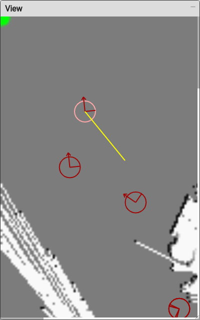

..
   Copyright (c) 2020, NVIDIA CORPORATION. All rights reserved.
   NVIDIA CORPORATION and its licensors retain all intellectual property
   and proprietary rights in and to this software, related documentation
   and any modifications thereto. Any use, reproduction, disclosure or
   distribution of this software and related documentation without an express
   license agreement from NVIDIA CORPORATION is strictly prohibited.

.. _interactive-markers:

Interactive Markers
---------------------------------

The first half of this chapter covers how the use of the markers in Websightserver. The second half
explain how to configure an application to expose the markers to a Websight user.

.. _3D-marker:

Interactive 3D Markers
^^^^^^^^^^^^^^^^^^^^^^^^^^^^^^^^^^^^^^^^

The *interactive marker* can be edited with in a number of ways:

* Left-click and hold: the widget will move along with the camera.
* Hold left-Alt and left-click: the widget will rotate in place when mouse is moved left or right,
  while left mouse button is down. The rotation depends on which segment of the widget gets the
  click. In this mode, the widget can also be moved with WASD and QE keys.
* Hold left-Alt and middle-click: the widget will translate along an axis when mouse is moved up or
  down, while middle mouse button is down. The axis will be the axis of the clicked segment.

.. image:: posetree-widget-3d-segment-selected.png
   :scale: 40%
   :align: center

An interactive 3D marker with a segment selected.

.. _2D-marker:

Interactive 2D Markers
^^^^^^^^^^^^^^^^^^^^^^^^^^^^^^^^^^^^^^^^

The *interactive markers* are represented as circles with projected coordinate frames drawn inside
them. (You must add a window in Sight to see the markers. See :ref:`sight-windows-menu` for more
information.) They can be translated by left-clicking on the axis, then dragging them to the desired
position. Their rotation about the z-axis can also be changed by clicking on the circumference and
dragging.

An interactive 2D marker being rotated. The yellow guide line goes from the widget center to the
mouse during rotation.

.. _interactive-markers-configuration:

Interactive Markers Configuration
^^^^^^^^^^^^^^^^^^^^^^^^^^^^^^^^^^^^^^^^

An application that need to use the *interactive markers* in Websight, needs to also use any
(or both) of the renderers. The only extra configuration required is to add an
:code:`IntreactiveMarkersBridge` component.

Once the bridge is present and configured. The interactive markers will always show in any
renderer widget of the application.

Interactive Markers Bridge
^^^^^^^^^^^^^^^^^^^^^^^^^^^^^^^^^^^^^^^^

The interactive markers bridge component requires very little configuration. It is a
three step configuration procedure. First, create a node that has the bridge and a message ledger.
Use a :code:`PoseInitializer` component for any marker needed by the application. And finally, since it
is a bridge; it requires to be connected to websight server.

The following is a code snippet with a typical node for an *interactive markers bridge* that will
use two markers:

.. code-block:: javascript

  "name": "interactive_markers_bridge",
      "components": [
        {
          "name": "message_ledger",
          "type": "isaac::alice::MessageLedger"
        },
        {
          "name": "InteractiveMarkersBridge",
          "type": "isaac::alice::InteractiveMarkersBridge"
        },
        {
          "name": "left_shoulder_initializer",
          "type": "isaac::alice::PoseInitializer"
        },
        {
          "name": "left_elbow_initializer",
          "type": "isaac::alice::PoseInitializer"
        }
      ]
  }

Note that pose initializers are included in the same node in this example. This is not a mandatory:
any pose initializer (in any node) that sets the property :code:`attach_interactive_marker` to :code:`true`
spans a marker. Poses can also be queried and used by any other component of the application in the
standard way, such as using :code:`PoseTree` with the *lhs* and *rhs* names defined here. This is the
configuration of such a node.

.. code-block:: javascript

  "interactive_markers_bridge": {
      "InteractiveMarkersBridge": {
        "tick_period": "0.4"
      },
      "left_shoulder_initializer": {
        "lhs_frame": "root",
        "rhs_frame": "leftShoulder",
        "pose": [1.0, 0.0, 0.0, 0.0, -1.0, 0.0, 0.0],
        "attach_interactive_marker": true
      },
      "left_elbow_initializer": {
        "lhs_frame": "leftShoulder",
        "rhs_frame": "leftElbow",
        "pose": [1.0, 0.0, 0.0, 0.0, 0.0, 0.0, 1.0],
        "attach_interactive_marker": true
      }
  }

And finally here are the two edges that connect the node with websight server.

.. code-block:: javascript

    {
      "source": "websight/WebsightServer/interactive_markers",
      "target": "interactive_markers_bridge/InteractiveMarkersBridge/request"
    },
    {
      "source": "interactive_markers_bridge/InteractiveMarkersBridge/reply",
      "target": "websight/WebsightServer/interactive_markers_reply"
    }

Additional Notes
^^^^^^^^^^^^^^^^^^^^^^^^^^^^^^^^^^^^^^^^

At the moment of initialization, the bridge will create and insert all the editable poses
in the :code:`PoseTree`. These poses can be later retrieved and used as any other pose in the
application: by querying the :code:`PoseTree`.

It is responsibility of the application to ensure that a pose is not edited by a sight user at the
same time that the application itself is editing it. If not, the most recent timestamp prevails.

An editable pose is always editable and hence always show a marker in web sight during application
execution.

As for any other channel, markers can be resized or their color can be modified. To do this, you can
click on the icon next to the marker's name, and you will find a slider to adjust the size, you can
also update the color or the alpha channel component.

There is a minimal working example for the *interactive markers* in
:code:`apps/samples/interactive_markers`

Another example for interactive markers in manually localizing the robot by reseeding the particles
for localization when it is difficult for the robot to localize in the correct location on the map.

**Follow the below steps to manually localize the robot:**

1. Make sure to set :code:`"attach_interactive_marker": true` under :code:`PoseInitializer` in your
   application configuration.
2. On Isaac Sight, right click on Map View and select “Settings”.
3. Under the Select Marker drop down list, choose “robot_init_global_localizer” and click on Add
   Marker. Click on Update.
  .. image:: interactive_marker_add.png
4. Click and hold on the interactive marker to drag the marker to desired location on the map.
  .. image:: interactive_marker_position.png
5. To adjust the angle, click and hold on the circumference of the interactive marker and rotate the
   marker to desired angle.
  .. image:: interactive_marker_angle.png
6. Once satisfied with the correct position & angle, select “reseed_particles” under
   Application Configuration > navigation.localization.scan_localization >
   Isaac.navigation.PaticleFilterLocalization and click Submit
  .. image:: interactive_marker_reseed-particles.png
7. Once the robot localizes in the new position, uncheck “reseed_particles” and click submit
