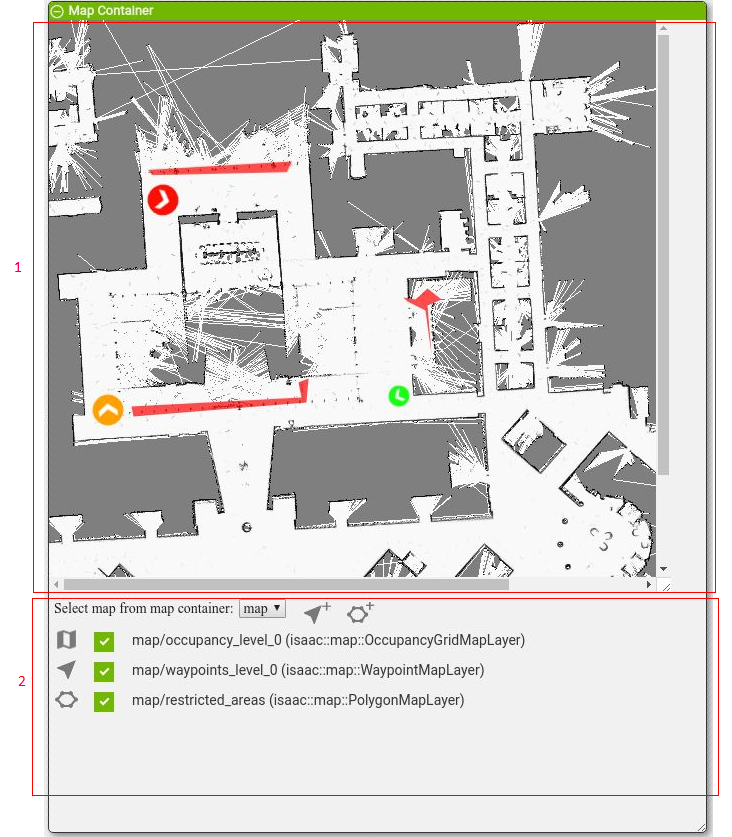
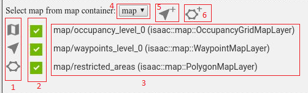
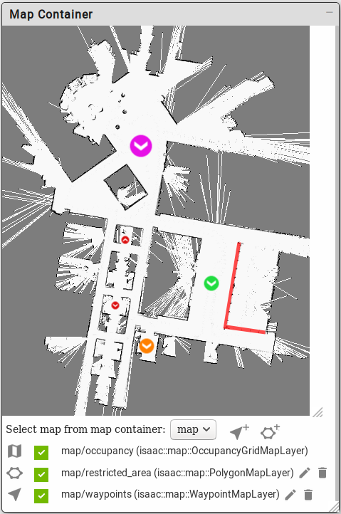
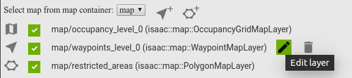
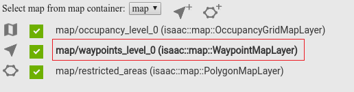
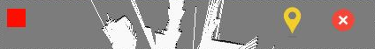

..
   Copyright (c) 2020, NVIDIA CORPORATION. All rights reserved.
   NVIDIA CORPORATION and its licensors retain all intellectual property
   and proprietary rights in and to this software, related documentation
   and any modifications thereto. Any use, reproduction, disclosure or
   distribution of this software and related documentation without an express
   license agreement from NVIDIA CORPORATION is strictly prohibited.

.. _map-editor-visualization:

Map Editor
-----------------------------------------

The Map Editor window allows you to visualize and annotate different map layers. When the page is
first loaded, the first map from the map editor is activated by default.

The upper section of the window [1] shows the map layers from the currently selected map.
The remainder of the window [2] shows information about maps and layers. Three types of layers are
supported.

  - OccucpancyGridMapLayer: A dense rectangular map which stores certain information per pixel.
  - WaypointMapLayer: A simple layer which stores annotatable points of interest called waypoints.
  - PolygonMapLayer: A layer which stores multiple polygons in the local layer coordinate frame.

The information section shows information about all of the maps:

1. Symbols representing different type of map layers:

  - First symbol represents OccupancyGridMapLayer.
  - Second symbol represents WaypointMapLayer.
  - Third symbol represents PolygonMapLayer.

2. Check box for each layer. Clicking selects/deselects corresponding layer for visualization.
3. Name of the layers and type in brackets.
4. List of maps in map editor. Selecting a map enables that map and loads all the layer
   information for that map.
5. Button to create new WaypointMapLayer, clicking shows a dialog for new layer.
6. Button to create new PolygonMapLayer, clicking shows a dialog for new layer.

.. note:: Enabling new map-editor-created layers is not supported in this release. To create new
          layers that can be enabled, first persistently store new map layers using map
          configuration parameters and then modify the application config/graph JSON (in this case,
          flatsim) to add the new layers. Modifying existing waypoint/polygon layers in map editor
          does function correctly.

Running Map Editor
^^^^^^^^^^^^^^^^^^^^^^^^^^^^^^^^^^^^^^^^

Start Map Editor with the following command:

.. code-block:: bash

   bob@desktop:~/isaac$ bazel run apps/map_editor -- --config <path_to_config_file> --graph <path_to_graph_file> --config_backup <path_to_backup_file>

Where:

- ``<path_to_config_file>`` is the full path to the file where the current map configuration is stored.
- ``<path_to_graph_file>`` is the full path to the file where the current map graph is stored.
- ``<path_to_backup_file>`` is the full path to the file where the edited config is saved when there is
  an update to the map. This file must exist prior to running the map editor application.

To run the Map Editor on a provided map of Nvidia's Building R:

.. code-block:: bash

   bob@desktop:~/isaac$ bazel run apps/map_editor -- --config apps/assets/maps/nvidia_R_180306.config.json --graph apps/assets/maps/nvidia_R_180306.graph.json --config_backup apps/assets/maps/nvidia_R_180306_backup.config.json

Running Map Editor using the above command will open the Map Container in Sight:

Any edits to the map will be saved into the file specified by ``<path_to_backup_file>`` on exit of the map editor application.

Editing Existing Map Layers
^^^^^^^^^^^^^^^^^^^^^^^^^^^^^^^^^^^^^^^^

Use the procedures in this section to edit existing map layers.

Adding New Waypoints or Polygons
................................

1. Click on edit icon for the layer.

The name of the layer that is enabled for editing is shown in bold. All other layers of
the same type are disabled.

2. Once the layer is enabled for editing, use the controls at the top of the window to edit the
layer.

Editing tools for waypoint layer are shown in the following screenshot:

The first button at the top left is for selecting a waypoint color, and the first button at the top
right is to start drawing waypoints. Clicking opens a dialog for specifying waypoint input like
radius and name:

  .. image:: map_editor_add_waypoint_dialog.png
     :align: center

After clicking OK a new waypoint of the specified color, radius, and name is drawn at the current
mouse position. The arrow direction indicates waypoint rotation.

Click the second button at top right to start removing waypoints. Subsequent mouse clicks on
waypoints delete selected waypoints.

Editing tools for polygon layer are shown in the following screenshot:

Click the first button at top right start to begin drawing polygons. Click on the occupancy map to
select polygon point. Every mouse left click marks a polygon point and a line is drawn from the
previous marked point to this point. Right clicking closes the polygon, drawing it in the color
specified for the layer.

Click the second button at top right to start removing polygons. Subsequent mouse clicks on polygons
delete selected polygons.

Modifying Existing Waypoints and Polygons
.........................................

To modify existing waypoints or polygons:

1. Enable the layer for editing.
2. Click Stop Drawing Objects if you were previously drawing objects with mouse clicks.
3. Click on the waypoint or polygon to edit. Controls are displayed as shown in the following screenshot:

  .. image:: map_editor_waypoint_controls.png
   :align: center

The following controls shown in the above screenshot:

1. Top left control
2. Top right control
3. Bottom left control
4. Bottom right control
5. Rotation control

Using these controls you can scale, reposition, or rotate waypoints and polygons. To reposition,
Click a waypoint or polygon and drag it to new position.

There are similar controls for polygon objects, as shown below:

  .. image:: map_editor_polygon_controls.png
   :align: center

Creating a New WaypointMapLayer
^^^^^^^^^^^^^^^^^^^^^^^^^^^^^^^^^^^^^^^^

1. Click Add new waypoint layer as shown in the following screenshot:

  .. image:: map_editor_add_new_waypoint_layer.png
   :align: center

A new dialog box opens for specification of a new layer.

  .. image:: map_editor_add_waypoint_layer.png
   :align: center

2. Enter the name of the waypoint layer and click OK to create the new layer, or click cancel.

Creating a New PolygonMapLayer
^^^^^^^^^^^^^^^^^^^^^^^^^^^^^^^^^^^^^^^^

1. Click Add new polygon layer as shown below:

  .. image:: map_editor_add_new_polygon_layer.png
   :align: center

A new dialog box opens for specification of input for the new layer.

  .. image:: map_editor_add_polygon_layer.png
   :align: center

2. Click the color picker to select a color for this layer.

3. Enter the name of the polygon layer and click OK to create the new layer, or click Cancel.

Deleting Layers
^^^^^^^^^^^^^^^^^^^^^^^^^^^^^^^^^^^^^^^^

To delete layers, modify the config and graph files that are passed to the Map Editor application
(map_editor) as arguments. For example, running map_editor with the following command shows 3
layers--an occupancy layer "occupancy", a waypoint layer "waypoints", and a polygon layer
"restricted_area"--in the map container window:

.. code-block:: bash

   bob@desktop:~/isaac$ bazel run apps/map_editor -- --config apps/assets/maps/nvidia_R_180306.config.json --graph apps/assets/maps/nvidia_R_180306.graph.json --config_backup apps/assets/maps/nvidia_R_180306_backup.config.json

To delete the "restricted_area" layer, remove the following component entry from
apps/assets/maps/nvidia_R_180306.graph.json:

.. code-block:: javascript

        {
          "name": "restricted_area",
          "type": "isaac::map::PolygonMapLayer"
        }

Also remove the following related configuration values from
apps/assets/maps/nvidia_R_180306.config.json:

.. code-block:: bash

    "restricted_area": {
      "polygons": {
        "atrium": {
          "points": [
            [30.4, 33.0],
            [42.5, 31.0],
            [43.3, 36.9],
            [42.8, 36.9],
            [42.0, 31.5],
            [30.4, 33.5]
          ]
        }
      },
      "tick_period": "1.0"
    }

GUI controls in Sight for deleting layers are planned to be implemented in a future release.

Enable/Disable Layers
^^^^^^^^^^^^^^^^^^^^^^^^^^^^^^^^^^^^^^^^

Click the check box before each layer to enable/disable layers. A green checkbox means the layer is
enabled and its contents are displayed. A gray check box means the layer is disabled.

