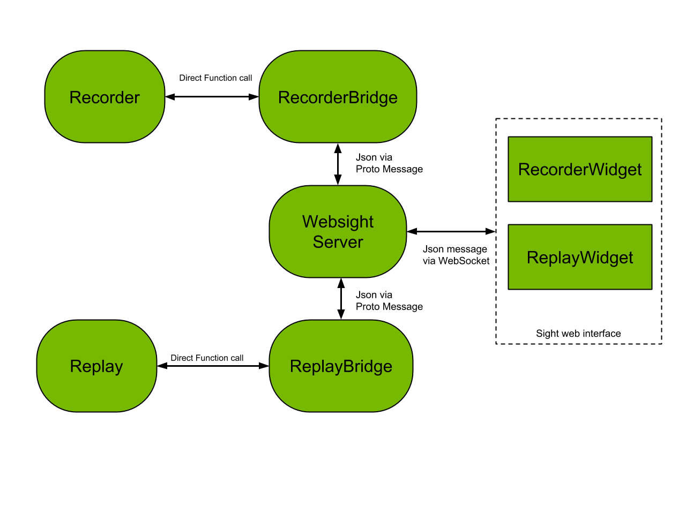

..
   Copyright (c) 2020, NVIDIA CORPORATION. All rights reserved.
   NVIDIA CORPORATION and its licensors retain all intellectual property
   and proprietary rights in and to this software, related documentation
   and any modifications thereto. Any use, reproduction, disclosure or
   distribution of this software and related documentation without an express
   license agreement from NVIDIA CORPORATION is strictly prohibited.

Record and Replay in Sight
--------------------------------------

In order to use the Record and Replay functionality from the sight web server, an application needs
to add not only *Recorder* and *Replay* components, but also *RecorderBridge* and *ReplayBridge*,
to enable communication between the websight server and the *Recorder* and *Replay* components.

As shown, a bridge component needs to be connected to both the websight server and its respective
*Recorder/Replay* component.

.. _recorder-widget:

Record Widget
^^^^^^^^^^^^^^^^^^^^^^^^^^^^^^^^^^^^^^^^

The record widget enables generation of multiple recordings during a single application execution
from the Websight UI. Recordings can be stopped and started at will.

The widget has two input areas to enter the two sections of the log path that are user defined. It
also has a button to start the recording. When the widget is recording, it shows the current
length of the recording in a chronometer.

.. image:: recorder.png
   :scale: 50%
   :align: center

Information about the previous recording in the current session is stored so that the exact path of
the log is available. This information is shown by clicking the plus button.

Note that when a recording is made using the widget, a numerical suffix is added to the tag field.
This makes it safe to create several records without modifying the *base directory* and *tag*
fields.

A popup strip on the bottom of the widget allows the user to see useful information. When the
recording button is clicked, the area shows at which time the recording started. When the stop
button is clicked, it shows the total length of the log in seconds and the absolute system path
to the output log folder.

.. _replay-widget:

Replay Widget
^^^^^^^^^^^^^^^^^^^^^^^^^^^^^^^^^^^^^^^^

The replay widget lets a user replay a recorded log. This widget maintains nanoseconds precision.

.. image:: replay.png
   :scale: 50%
   :align: center

Until a log is not loaded for replay, only the *Load Log* button and the *Input folder path*
field are interactive. The root folder of a recorded log must be specified in the
*Input folder path* field.

The *Load log* button loads the logs from the folder in the replay component. Subsequent messages
report success or errors.

After a successful load, the *start* and *end* time reflects the actual start and end times of the
log in nanoseconds. At that point the start button is active and can be used to start log replay.

The *Set Time Box* and *Set Time* buttons are also  interactive after a successful load. Use the
widget to start a replay at the very start of the log or from a time in between.

To start the replay after the beginning of the log, manually set the start time using the
*Current Time* input box and click *Set*, or move the time line thumb on its slider.

After starting the replay, the time line widget, the set time area, and the load log area become
non-interactive until you stop it or the replay does not stop by itself. You can start and stop the
replay multiple times. The set start time area remains interactive only after successful load and
before start of a replay.

Note that the time line component on the widget is created using bootstrap-slider from
https://github.com/seiyria/bootstrap-slider.

Record and Replay Widget Setup
^^^^^^^^^^^^^^^^^^^^^^^^^^^^^^^^^^^^^^^^

This section describes how to connect the Bridge components and the Websight server. This
connection must be made in addition to the connections described in section :ref:`log-folder`.

The following example shows how to create the *Recorder* Bridge component and connect it to the
Websight Server using C++ or JSON configuration.

.. code-block:: c++

  // Create a bridge between record and websight
  auto* recorder_bridge_node = app.createMessageNode("recorder_bridge");
  auto* recorder_bridge = recorder_bridge_node->addComponent<RecorderBridge>("RecorderBridge");
  Connect(websight, "record", recorder_bridge->rx_request());
  Connect(recorder_bridge->tx_reply(), websight, "recorder_reply");

.. code-block:: javascript

    {
      "name": "recorder_bridge",
      "components": [
        {
          "name": "message_ledger",
          "type": "isaac::alice::MessageLedger"
        },
        {
          "name": "RecorderBridge",
          "type": "isaac::alice::RecorderBridge"
        }
      ]
    }

.. code-block:: javascript

    {
      "source": "websight/WebsightServer/record",
      "target": "recorder_bridge/RecorderBridge/request"
    },
    {
      "source": "recorder_bridge/RecorderBridge/reply",
      "target": "websight/WebsightServer/recorder_reply"
    }

A two-way connection is needed to establish communication between the websight server and the
Recorder bridge. This requires defining two edges between the Recorder bridge and Websight server,
as shown above.

The *Replay* Bridge component is equivalent.

.. code-block:: c++

  auto* replay_bridge_node = app.createMessageNode("replay_bridge");
  auto* replay_bridge = replay_bridge_node->addComponent<ReplayBridge>("ReplayBridge");
  Connect(websight, "replay", replay_bridge->rx_request());
  Connect(replay_bridge->tx_reply(), websight, "replay_reply");

.. code-block:: javascript

    {
      "name": "replay_bridge",
      "components": [
        {
          "name": "message_ledger",
          "type": "isaac::alice::MessageLedger"
        },
        {
          "name": "ReplayBridge",
          "type": "isaac::alice::ReplayBridge"
        }
      ]
    }

.. code-block:: javascript

    {
      "source": "websight/WebsightServer/replay",
      "target": "replay_bridge/ReplayBridge/request"
    },
    {
      "source": "replay_bridge/ReplayBridge/reply",
      "target": "websight/WebsightServer/replay_reply"
    }

The bridge components require definitions of initial configurations. For the Recorder bridge,
the name of the recording component that is being controlled is required, as shown in the following:

.. code-block:: javascript

  "recorder_bridge": {
    "RecorderBridge": {
      "recorder_component_name": "recorder/isaac.alice.Recorder"
    }
  }

The Replay Bridge configuration is similar:

.. code-block:: javascript

  "replay_bridge": {
    "ReplayBridge": {
      "replay_component_name": "replay/isaac.alice.Replay"
    }
  }
