..
   Copyright (c) 2020, NVIDIA CORPORATION. All rights reserved.
   NVIDIA CORPORATION and its licensors retain all intellectual property
   and proprietary rights in and to this software, related documentation
   and any modifications thereto. Any use, reproduction, disclosure or
   distribution of this software and related documentation without an express
   license agreement from NVIDIA CORPORATION is strictly prohibited.

.. _skeleton_pose_estimation:

2D Skeleton Pose Estimation
===========================

Robotics requires applications that can detect and estimate poses, track and estimate future states,
and reason about these states to make decisions about a wide variety of articulate objects. Primary
examples of such objects include people, machinery, and inanimate objects. Pose estimation for
people is particularly complex, due to the complexity of their behavior and a wide variety of
clothing. This complexity is further amplified by the biases in probability distributions of data
and by the presence of rare cases in the data.

The 2D Skeleton Pose Estimation application in Isaac SDK provides the framework to run inference
using the pose-estimaton model described in "2D Skeleton Pose Estimation for Articulate Objects with
Part Affinity Fields" (`Zhe et al.`_). This application aims at low-latency joint real-time
object detection and 2D keypoint pose estimation by leveraging GPU acceleration while achieving good
accuracy.

Multiple instances of an object class can be processed at a time; in fact, there is no hard limit on
the number of object instances that can be processed simultaneously. Overlapping, occlusion, and
self-occlusion cases are supported. Local out-of-frame occlusion keypoint estimation is also
available.

.. _Zhe et al.: https://arxiv.org/pdf/1812.08008.pdf

Application Overview
----------------------------------

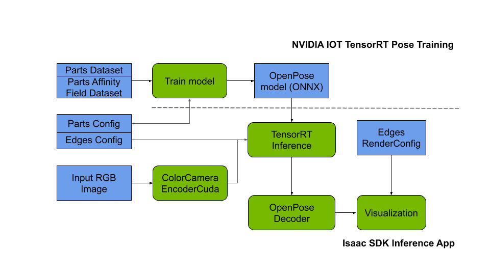

   ..

   Skeleton (2D Keypoints) Pose Estimation

The 2D Skeleton Pose Estimation application consists of an inference application and a neural
network training application.

The inference application takes an RGB image, encodes it as a tensor, runs TensorRT inference to
jointly detect and estimate keypoints, and determines the connectivity of keypoints and 2D poses for
objects of interest. To run inference, this application requires a trained neural network for the
object of interest.

To train the neural network, you can use the NVIDIA AI IOT `TensorRT Pose Estimation`_ open source
project. It allows distributed GPU training from COCO_ type datasets using the PyTorch_ open
source machine learning library. Alternatively, any Part Affinity Field compatible neural network
training code can be used.

.. _TensorRT Pose Estimation: https://github.com/NVIDIA-AI-IOT/trt_pose
.. _COCO: http://cocodataset.org/#home
.. _PyTorch: https://pytorch.org/

Inference
----------------------------------

The following computational graph outlines the end-to-end inference of the keypoint pose estimation
model from a single RGB image:

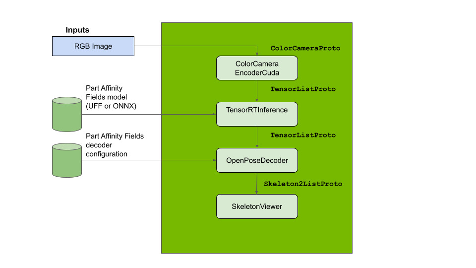

Running Inference
^^^^^^^^^^^^^^^^^^

To run the inference application on static image data, run the following command
within Isaac SDK:

.. code-block:: bash

   bob@desktop:~/isaac$ bazel run packages/skeleton_pose_estimation/apps/openpose:openpose_inference

.. note:: While the model is able to run inference in real time, first-time deployment of the model
   requires optimization of the neural network to the target GPU device. This optimization can take
   20 to 60 seconds. Consecutive deployments take 1-2 seconds to load and are primarily bound by
   disk (i/o) performance of the target system.

The application takes a monocular camera feed from a static image and outputs the estimated 2D
keypoints of the detected objects. The estimated pose can be automatically visualized in Sight
at http://localhost:3000.

.. note:: To recover the scale and aspect ratio of the original image in the output, set the output
   scale in the OpenPoseDecoder configuration. For example, if the original image (or camera) input
   has 640x480 pixels resolution, the output scale should be set to [480, 640]:

   .. code-block:: javascript

      "isaac.skeleton_pose_estimation.OpenPoseDecoder": {
         "output_scale": [480, 640]

Running Inference on Embedded Platforms
^^^^^^^^^^^^^^^^^^^^^^^^^^^^^^^^^^^^^^^

Inference requires a non-trivial amount of resources that may result in system strain on embedded
platforms like the Jetson Nano and Jetson TX2. A selection of models that work at different input
resolutions and input/output resolution factors (1:2, 1:4) is available to better fit the
constraints of a particular use case.

An example of a high performance model suitable to Jetson Nano is available. This model uses a
1:4 scale factor and is designed to provide a good tradeoff between model accuracy and the
real-time processing constraints of GPU-CPU memory transfers and computational capacity.
To deploy this model on Jetson Nano, follow these steps:

1. Deploy the *//packages/skeleton_pose_estimation/apps/openpose:trt_pose_inference-pkg*
   to the robot as explained in :ref:`deployment_device`.

2. Switch to the directory of the deployed package on the Jetson with the following command:

   .. code-block:: bash

      user@jetson:~/$ cd ~/deploy/bob/trt_pose_inference-pkg

   Where "bob" is your username on the host system.

3. Run the application with the following command:

   .. code-block:: bash

      user@jetson:~/deploy/bob/trt_pose_inference-pkg-pkg/$ ./packages/skeleton_pose_estimation/apps/openpose/trt_pose_inference

Message Types
^^^^^^^^^^^^^^^^^^^^^^^^^^^^^^^^^^^^^^^

The inference application utilizes the following message types:

* :ref:`ColorCameraProto <ColorCameraProto>`

* :ref:`TensorListProto <TensorListProto>`

* :ref:`Skeleton2Proto <Skeleton2Proto>`

* :ref:`Skeleton2ListProto <Skeleton2ListProto>`

Codelets
^^^^^^^^^^^^^^^^^^^^^^^^^^^^^^^^^^^^^^^

The inference application utilizes the following codelets:

* :ref:`ImageLoader <isaac.message_generators.ImageLoader>`

* :ref:`ColorCameraEncoderCuda <isaac.ml.ColorCameraEncoderCuda>`

* :ref:`TensorRTInference <isaac.ml.TensorRTInference>`

* :ref:`OpenPoseDecoder <isaac.skeleton_pose_estimation.OpenPoseDecoder>`

* :ref:`SkeletonViewer <isaac.viewers.SkeletonViewer>`

Sample inference
^^^^^^^^^^^^^^^^^^^^^^^^^^^^^^^^^^^^^^^
The images below demonstrate the inference output and post-processing steps of the OpenPose
algorithm (detected objects, graph connectivity and parts locations):

.. image:: images/inference1.jpg
   :align: center
   :width: 50.0%

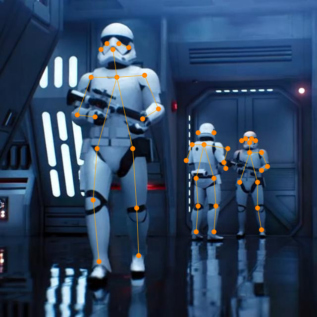

Training
--------

The following steps use NVIDIA AI IOT TensorRT Pose Estimation to train the neural network.
For more details, please refer to the TensorRT Pose Estimation documentation_.

.. _documentation: https://github.com/NVIDIA-AI-IOT/trt_pose

.. note:: Model training requires a non-trivial amount of resources. We recommend training neural
   networks on the NVIDIA DGX, NVIDIA DGX Station, or a multi-GPU virtual machine instance. Even
   with a powerful machine, it takes a non-trivial amount of time to download the dataset,
   pre-process the data, train the model, and export it.

Step 1. Pre-requisites Installation with a Docker container
^^^^^^^^^^^^^^^^^^^^^^^^^^^^^^^^^^^^^^^^^^^^^^^^^^^^^^^^^^^

NVIDIA NGC provides a ready-to-use NVIDIA PyTorch 1.2 Docker image that has all pre-requisite
components for training an NVIDIA AI IOT TensorRT Pose Estimation model. Please pull and run a Docker
container using the following commands:

.. note:: Please refer to the `NVIDIA NGC Setup`_ page to get access to the container and to set up
          Docker.

.. code-block:: bash

   docker pull nvcr.io/nvidia/pytorch:19.09-py3
   nvidia-docker run -it nvcr.io/nvidia/pytorch:19.09-py3

.. _NVIDIA NGC Setup: https://ngc.nvidia.com/setup

Step 2. Installation
^^^^^^^^^^^^^^^^^^^^

Clone the NVIDIA AI IOT TensorRT Pose Estimation repository and install it:

.. code-block:: bash

   git clone https://github.com/NVIDIA-AI-IOT/trt_pose
   cd trt_pose
   python3 setup.py install --user

Step 3. Downloading COCO 2017 and Pre-Processing
^^^^^^^^^^^^^^^^^^^^^^^^^^^^^^^^^^^^^^^^^^^^^^^^

Download the COCO 2017 dataset and pre-process it with the following commands:

.. note:: Ensure you have at least 50 Gb of space available for the 20 Gb download and workspace.
.. code-block:: bash

   cd tasks/human_pose/
   bash download_coco.sh
   unzip val2017.zip
   unzip train2017.zip
   unzip annotations_trainval2017.zip
   python3 preprocess_coco_person.py annotations/person_keypoints_train2017.json annotations/person_keypoints_train2017_modified.json
   python3 preprocess_coco_person.py annotations/person_keypoints_val2017.json annotations/person_keypoints_val2017_modified.json

Step 4. Model Training
^^^^^^^^^^^^^^^^^^^^^^
Train the DNN with the following commands:

.. code-block:: bash

   cd tasks/human_pose/
   python3 -m trt_pose.train experiments/resnet18_baseline_att_224x224_A.json

.. note:: Alternate model resolutions and architectures are available in the :code:`experiments`
          folder.

Step 5. Conversion to ONNX Model
^^^^^^^^^^^^^^^^^^^^^^^^^^^^^^^^

The TensorRT Pose Estimation package contains a utility to convert trained models from the PyTorch
framework to a common ONNX format. In this application, the PyTorch parser reads the model weights
and converts them to ONNX so they can be used for inference by the TensorRT codelet.

At the end of the training iterations, the PyTorch model is saved as a *.pth* file. You then
need to convert it to the ONNX model using the python script and ONNX parser.

For example, at the end of the 249th epoch, the PyTorch model is saved as *experiments/resnet18_baseline_att_224x224_A.json.checkpoints/epoch_249.pth* and can be converted to
an ONNX model using the following command:

.. code-block:: bash

   cd tasks/human_pose/
   cp experiments/resnet18_baseline_att_224x224_A.json.checkpoints/epoch_249.pth \
        resnet18_baseline_att_224x224_A_epoch_249.pth

   python3 ../../trt_pose/utils/export_for_isaac.py --input_checkpoint resnet18_baseline_att_224x224_A_epoch_249.pth

Running the commands above will produce a *resnet18_baseline_att_224x224_A_epoch_249.onnx* file,
which you can then use as an input model. Refer to the *trt_pose_inference.app.json*
example and :ref:`TensorRTInference <isaac.ml.TensorRTInference>` configuration for more details.

Description and Parameters of the OpenPose Algorithm
----------------------------------------------------

This section walks through the steps of the OpenPose Algorithm. For more details, please refer to
the OpenPose_ paper and the :ref:`OpenPoseDecoder API <isaac.skeleton_pose_estimation.OpenPoseDecoder>` reference.

.. _OpenPose: https://arxiv.org/pdf/1812.08008.pdf

Step 1. Image Input, Rescaling, and Normalization
^^^^^^^^^^^^^^^^^^^^^^^^^^^^^^^^^^^^^^^^^^^^^^^^^

The :ref:`ImageLoader <isaac.message_generators.ImageLoader>` component encodes the image input as
a :ref:`ColorCameraProto` containing a single RGB image. The raw image is downsampled and stored as
a 3D tensor (WxHx3) in a :ref:`TensorListProto`. This tensor normalization type is specified by
a parameter in the :ref:`ColorCameraEncoderCuda <isaac.ml.ColorCameraEncoderCuda>` component.
This parameter, along with the tensor size, is set during neural network training and should be set
to the same value (for example, :code:`Unit` for unit normalization) at inference time. Small
variations of the tensor size are allowed, but large variations can cause issues (for example,
switching the aspect ratio of the tensor from 1:1 to 16:9 degrades network performance drastically).

.. note:: At the Image Normalization step, the image scale and aspect ratio are discarded in the
   ColorCameraEncoderCuda codelet. To recover the scale information, set the output scale
   in the OpenPoseDecoder configuration. For example, if the original image (or
   camera) input has 640x480 pixels resolution, the output scale should be set to [480, 640]:

   .. code-block:: javascript

      "isaac.skeleton_pose_estimation.OpenPoseDecoder": {
         "output_scale": [480, 640]

Below is a sample image input for inference:

Step 2. Inference
^^^^^^^^^^^^^^^^^

The OpenPoseDecoder runs inference on the model, which produces Part Affinity
Fields, Parts Gaussian Heatmaps, and Parts Gaussian Heatmaps MaxPool tensors. Please refer to the
OpenPose_ paper for detailed architecture of the neural network.

As a first step in the algorithm, the :ref:`TensorRTInference <isaac.ml.TensorRTInference>`
component analyzes the Gaussian Heatmap tensor to determine object part (or joint) candidate
locations. The size of this heatmap is normally 1/2 or 1/4 of the image size.

The dimensionality of this tensor is set at the training time and should match the dimensions, input
image size, and number of object parts specified in the TensorRTInference codelet.
Below is an example with an input RGB image size set to :code:`640x480` and number of parts set
to :code:`2`:

   .. code-block:: javascript

      "isaac.ml.TensorRTInference": {
        "input_tensor_info": [
          {
            "operation_name": "input",
            "dims": [3, 480, 640]
          }
        ],
        "output_tensor_info": [
          ...
          {
            "operation_name": "heatmap",
            "dims": [120, 160, 2]
          },
          ...
      "isaac.skeleton_pose_estimation.OpenPoseDecoder": {
        "labels": ["Wrist", "Elbow"],

The visualization of the Gaussian Heatmap tensor is provided below, with the colors corresponding
to last dimension of the tensor: Label:Wrist, color:red, index:0, Label:Elbow, color:green, index:1.

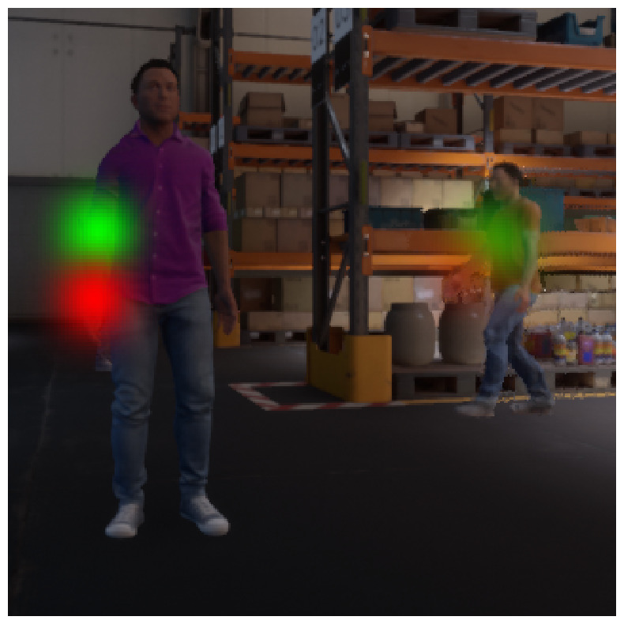

Step 3. Max-Pooling
^^^^^^^^^^^^^^^^^^^

Next, the OpenPoseDecoder applies a max-pooling operation to the Gaussian Heatmap with a
kernel size determined at training time. This max-pooling operation provides a basis for
the non-maximum suppression algorithm, which allows it to localize the `peaks` of the part
candidate locations.

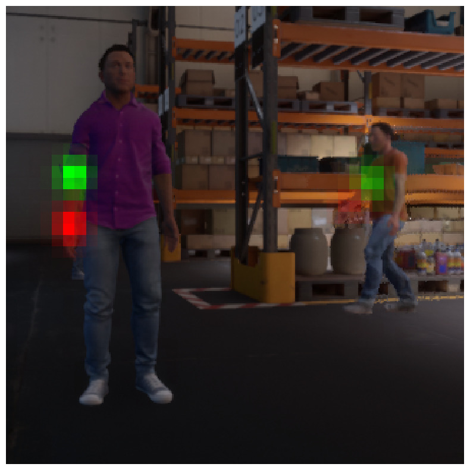

Step 4. Non-Maximum Suppression
^^^^^^^^^^^^^^^^^^^^^^^^^^^^^^^

Next, the OpenPoseDecoder performs non-maximum suppression using the 'equal' operation on
the Gaussian Heatmap and Gaussian Heatmaps MaxPool tensors. This operation provides peak candidate
locations for the part candidate locations.

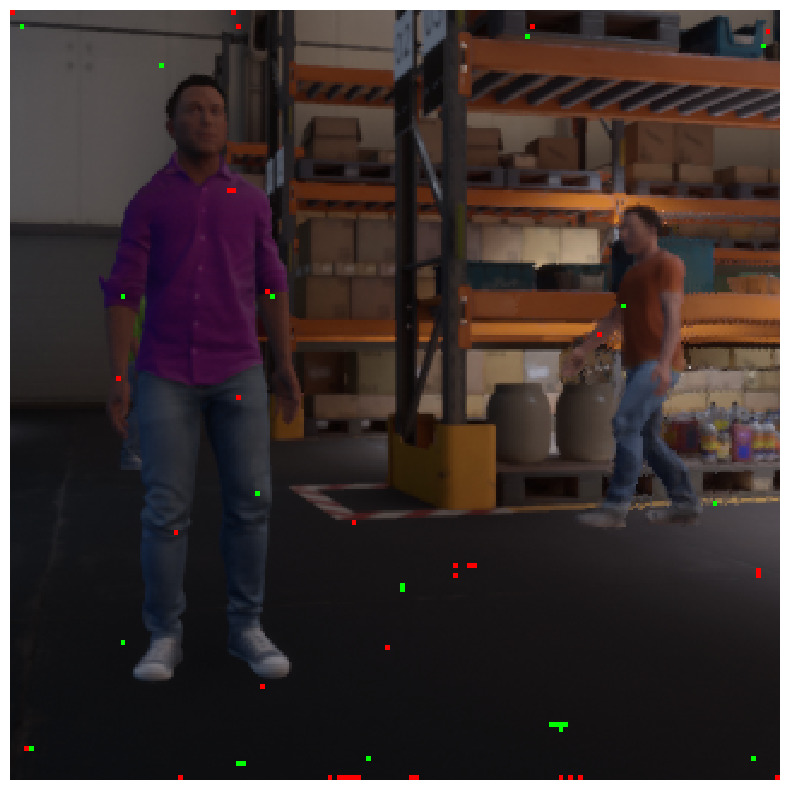

Step 5. Generating Peak Candidates
^^^^^^^^^^^^^^^^^^^^^^^^^^^^^^^^^^

Peak candidates have "confidence" values associated with them, which are derived from the original
Gaussian Heatmap. In the following visualization, the opacity of the peak color determines the
confidence.

.. note:: Nearly all peaks from the previous heatmap have low opacity and are invisible.

Step 6. Generating Part Candidates
^^^^^^^^^^^^^^^^^^^^^^^^^^^^^^^^^^

A threshold is applied to the confidence value of each peak candidate to get a final list of part
candidates. This threshold can be adjusted using the :code:`threshold_heatmap` parameter for the
OpenPoseDecoder. Normal value ranges for this threshold are :code:`0.01` to :code:`0.1`.

The binary heat map below shows the final list of part candidates. Note that colors correspond to
the binary maps of individual part candidates, like with the other visualizations.

Step 7. Generating Edge Candidates
^^^^^^^^^^^^^^^^^^^^^^^^^^^^^^^^^^

Next, the OpenPoseDecoder creates a list of edge candidates based on the prior
configuration of the edge connectivity. This connectivity is set in the OpenPoseDecoder
configuration. Below is an example with a single edge of "Wrist" -> "Elbow" that would correspond to
an "Arm":

.. note:: Edges of the graph are *directional*. These directions should match the *field directions*
   of the Part Affinity Fields tensor.

.. note:: In the "edges" configuration, indices to the "labels" array are specified.

.. code-block:: javascript

   "isaac.skeleton_pose_estimation.OpenPoseDecoder": {
      "labels": ["Wrist", "Elbow"],
      "edges": [[1, 0] ...

Below is a visualization of a list of edge candidates:

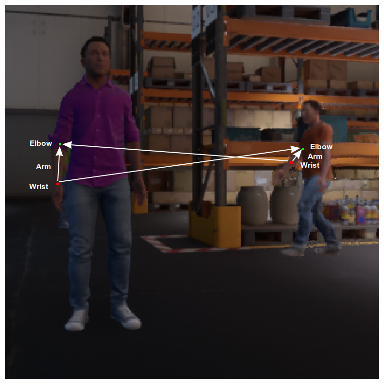

Step 8. Assigning Scores to Edge Candidates
^^^^^^^^^^^^^^^^^^^^^^^^^^^^^^^^^^^^^^^^^^^

To determine a final list of edges using edge candidates, the OpenPoseDecoder calculates a
score for each edge candidate based on the Part Affinity Fields tensor. The following is an example
of such a tensor for a *single* Part Affinity Field for "Arm" ("Wrist" -> "Elbow" edge).

.. note::

   In the TensorRTInference configuration, the last dimension size is double the number of
   "edges" because the Part Affinity Field is a vector field with *two* (horizontal and
   vertical) components.

   .. code-block:: javascript

        "output_tensor_info": [
          {
            "operation_name": "part_affinity_fields",
            "dims": [120, 160, 2]
          },

The OpenPoseDecoder :code:`edges_paf` parameter determines indices for the Part Affinity Field
tensor for horizontal and vertical components of the field:

   .. code-block:: javascript

      "isaac.skeleton_pose_estimation.OpenPoseDecoder": {
        "edges_paf": [[1,0] ...

Below is a visualization of Part Affinity Field for "Arm" ("Wrist" -> "Elbow" edge):

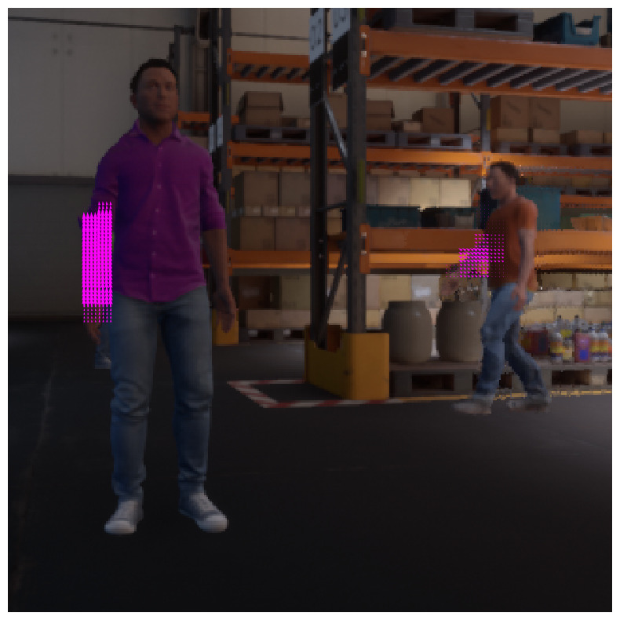

Below is a magnified image of a Part Affinity Field for "Arm" ("Wrist" -> "Elbow" edge) and a
list of parts candidates. Note that each arrow on that figure is a visualization of an individual
vector of the Part Affinity Field. Two part candidates for "Wrist" and "Elbow" are also shown.

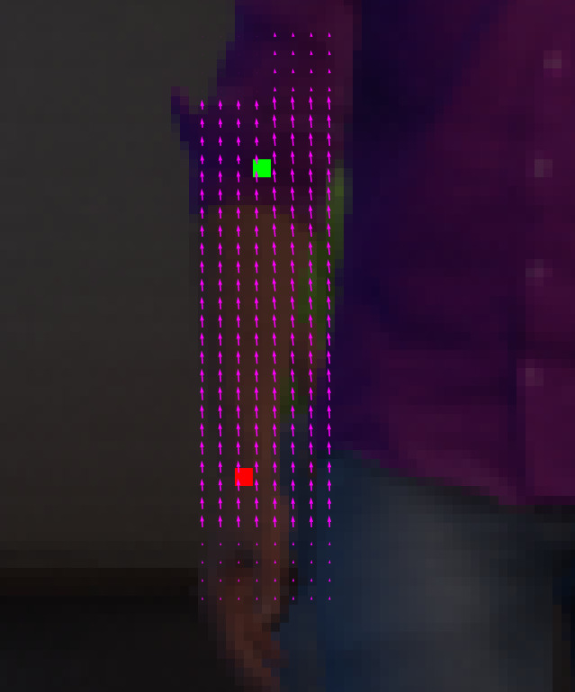

To calculate the score for each edge candidate, the OpenPoseDecoder calculates the
line-integral estimate of dot products between the Part Affinity Field vectors and an Edge Candidate
vector. The :code:`edge_sampling_steps` parameter can be used to determine the number of
integration sampling steps.

The following image shows an example line-integral estimate:

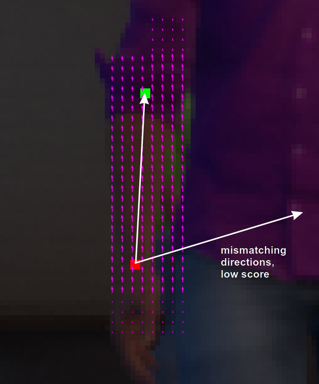

Step 9. Applying Thresholds to Edge Candidates
^^^^^^^^^^^^^^^^^^^^^^^^^^^^^^^^^^^^^^^^^^^^^^

The OpenPoseDecoder applies a final set of thresholds to edge candidate scores to
determine the list of edges. The :code:`threshold_edge_score` is a threshold for each individual
dot product of the integration step. Normal values for this threshold range from :code:`0.01` to
:code:`0.05`.

The :code:`threshold_edge_sampling_counter` is a threshold for the number of individual dot products
above the :code:`threshold_edge_score`: If the number exceeds this threshold, an Edge Candidate is
considered an Edge.

   .. code-block:: javascript

        "threshold_edge_score" : 0.01,
        "threshold_edge_sampling_counter" : 4,

Below is a visualization of a final list of Edges after the integration step and thresholding:

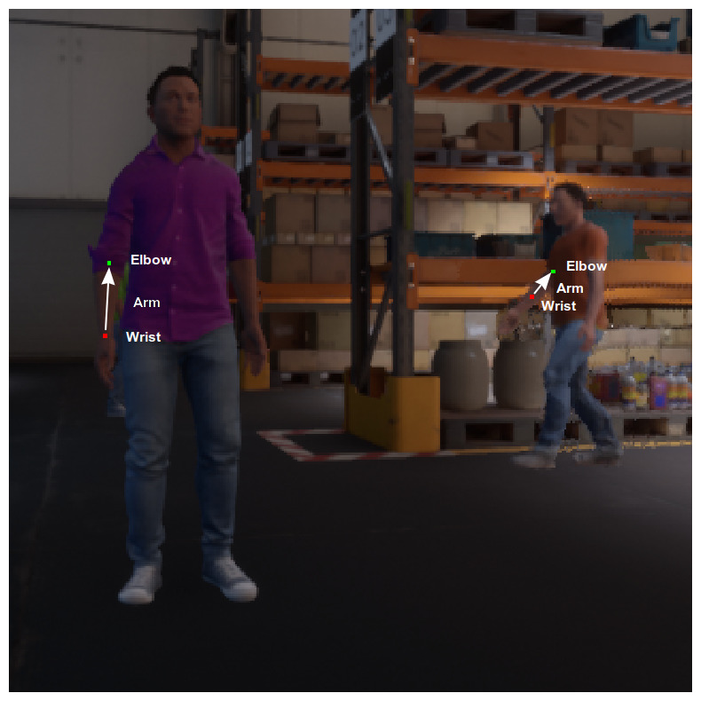

Step 10. Applying a Graph-Matching Algorithm
^^^^^^^^^^^^^^^^^^^^^^^^^^^^^^^^^^^^^^^^^^^^

After determining a list of parts, edges, and their scores, the OpenPoseDecoder applies a
graph-matching algorithm to determine the final list of objects (skeletons). After the
graph-matching algorithm is applied, the following thresholds are applied to filter out objects by
the minimum number of parts and score:

   .. code-block:: javascript

        "threshold_part_counter" : 1,
        "threshold_object_score" : 0.1,

Step 11. Merging Split Graphs
^^^^^^^^^^^^^^^^^^^^^^^^^^^^^

In some cases, two Parts can still be present after non-maximum suppression,
which results in objects being split into disconnected graphs. Such disconnected graphs are merged
into a single graph if the score that splits the object into two disconnected
graphs is less than the :code:`objects_split_score`. The following parameter is available to control
this algorithm:

   .. code-block:: javascript

        "threshold_split_score" : 2,

Step 12. Refining the Parts Coordinates (Optional)
^^^^^^^^^^^^^^^^^^^^^^^^^^^^^^^^^^^^^^^^^^^^^^^^^^

Once the final object list is available, parts coordinates can be refined from integer indices
into a Gaussian Heatmaps tensor. This functionality is available by setting the
:code:`refine_parts_coordinates` parameter to :code:`true`. This step is normally required when the
network has a 1:4 input/output resolution factor.

.. note:: The output of "refined parts coordinates" are floating point subpixel coordinates placed
   at "grid centers", rather than integer rows and columns.

.. code-block:: javascript

     "refine_parts_coordinates" : true,

Step 13. Visualization (Optional)
^^^^^^^^^^^^^^^^^^^^^^^^^^^^^^^^^
Below is the final visualization of detected objects, graph connectivity, and parts locations:

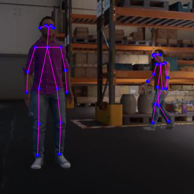
